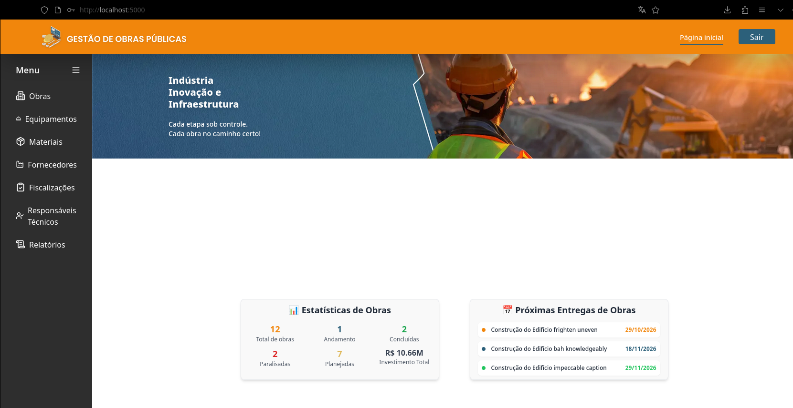

# Projeto Final

Repositório de escolha: https://github.com/burgues0/gerenciamento_obras_frontend

## APIs de Escolha

### Auth API

**Linguagem**: javascript + express
**Função**: Autenticação e gestão de usuários do sistema de gerenciamento de obras. Gera e valida tokens JWT pra autenticação, e expoe endpoint de validação consumido pelo backend a cada request

**Rotas principais**:

| metodo | Rota | Descrição |
|--------|------|-----------|
| POST | `/auth/login` | Login com e-mail e senha |
| POST | `/auth/magic` | solicitar magic link |
| POST | `/auth/validate` | validar token JWT |
| POST | `/auth/check` | Verificar status do token |
| GET/POST/PUT/PATCH/DELETE | `/usuarios` | CRUD de usuários |
| GET/POST/PUT/PATCH/DELETE | `/Notificacoes` | CRUD de notificações |
| GET/POST/PUT/PATCH/DELETE | `/PermissoesUsuarios` | CRUD de permissões |
| GET/POST/PUT/PATCH/DELETE | `/comentarios` | CRUD de comentários (autenticado) |

---

### Backend

**Linguagem**: typescript + nestjs 
**Função**: Gerencia as obras, incluindo etapas, diarios de obra, fiscailzações, materiais, equipamentos, fornecedores e responsaveis técnicos. Toda rota é protegida por guard que valida o token pela api de autenticação

**Rotas**:

| metodo | Rota | Descrição |
|--------|------|-----------|
| GET/POST | `/obras` | Listar e criar obras |
| GET/PUT/DELETE | `/obras/:id` | Detalhar, atualizar e remover obra |
| GET/POST/PUT/DELETE | `/obras/:idObra/etapas/:etapaId` | Gestão de etapas da obra |
| GET/POST/PUT/DELETE | `/obras/:idObra/diarios/:diarioId` | Diários de obra |
| GET/POST/DELETE | `/obras/:id/fiscalizacoes` | Fiscalizações vinculadas |
| GET/POST/PUT/DELETE | `/materiais` | Cadastro de materiais |
| GET/POST/PUT/DELETE | `/equipamentos` | Cadastro de equipamentos |
| GET/POST/PUT/DELETE | `/fornecedores` | Fornecedores e obras associadas |
| GET/POST/PUT/DELETE | `/responsaveis-tecnicos` | Responsáveis técnicos |
| GET/POST/PUT/DELETE | `/enderecos` | Endereços |
| GET | `/relatorios` | Relatórios gerenciais |

# Infra

## 1. Subir Sonarqube + Runner Local

> limpar docker pra começar do zero
```bash
cd infra
./cleardocker.sh
```

> subir container pra rodar o runner + sonar local
```bash
docker compose up -d
```

> criar projeto no sonarqube + pegar token pra usar na pipeline
```bash
curl -u admin:admin http://localhost:9000/api/projects/create -d "name=gerenciadeconfig" -d "project=gerenciadeconfig"
curl -v -u admin:admin http://localhost:9000/api/user_tokens/generate -d "name=gerenciadeconfig"
```

> entrar no container do runner e executar os comandos pra configurar o runner local
```bash
docker exec -it gh_runner /bin/bash
```

> criar um user sem ser o root
```bash
useradd -rm -d /home/user -s /bin/bash -g root -u 1000 user
echo 'user:password' | chpasswd
su user
```

> seguir comandos q o github passa pra criar o runner local (https://github.com/burgues0/k8s-exercicio-diego/settings/actions/runners/new)

# 2. Terraform + Ansible

> rodar o terraform init + apply
```bash
cd terraform
terraform init -upgrade
terraform apply -var-file=./vars/terraform.tfvars -auto-approve
```

> rodar o ansible
```bash
ansible-playbook docker.yaml -e "docker_registry_user=user docker_registry_password=token"
```

# 3. Kubernetes

> subir o cluster do k3d
```bash
k3d cluster create projeto-final --servers 1 --agents 3 -p "8080:80@loadbalancer"
kubectl label nodes k3d-projeto-final-agent-0 ambiente=dev
kubectl label nodes k3d-projeto-final-agent-1 ambiente=hmg
```

> adicionar o apontamento no hosts
```bash
sudo echo "127.0.0.1    dev.local" >> /etc/hosts
sudo echo "127.0.0.1    hmg.local" >> /etc/hosts
```

> rodar o ansible
```bash
cd ansible
dev | ansible-playbook k8s-deploy.yaml -e "dockerhub_user=user dockerhub_password=token"
hmg | ansible-playbook k8s-deploy.yaml -e "env=hmg dockerhub_user=user dockerhub_password=token"
```

# 4. Gateway

> rodar o ansible
```bash
cd ansible
ansible-playbook gateway.yaml
```

# 5. Validar
`http://localhost:5000/login`

- user exemplo: admin@test.com
- senha exemplo: admin123

